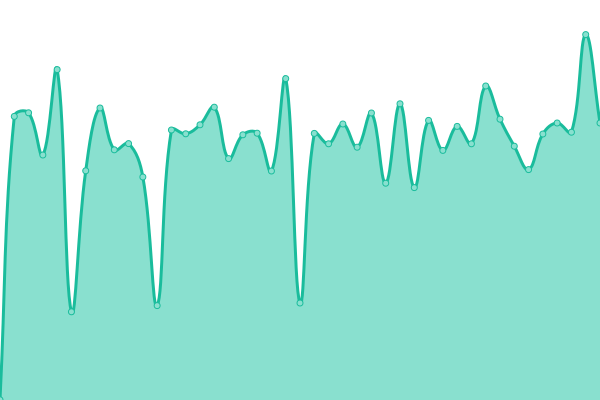
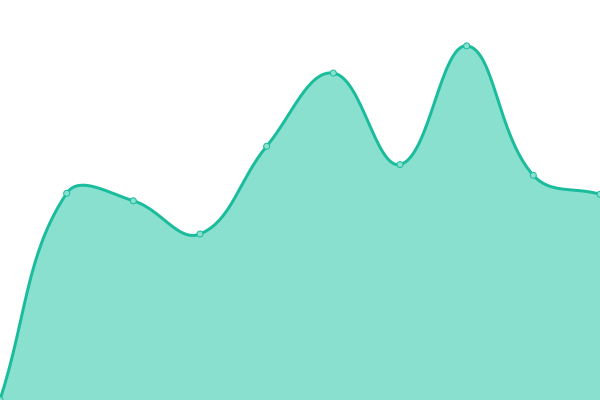

# [📈 Live Status](https://techeek.github.io/upptime): <!--live status--> **🟧 Partial outage**

This repository contains the open-source uptime monitor and status page for [张诚](www.techeek.cn), powered by [Upptime](https://github.com/upptime/upptime).

With [Upptime](https://upptime.js.org), you can get your own unlimited and free uptime monitor and status page, powered entirely by a GitHub repository. We use [Issues](https://github.com/techeek/upptime/issues) as incident reports, [Actions](https://github.com/techeek/upptime/actions) as uptime monitors, and [Pages](https://techeek.github.io/upptime) for the status page.

<!--start: status pages-->
<!-- This summary is generated by Upptime (https://github.com/upptime/upptime) -->
<!-- Do not edit this manually, your changes will be overwritten -->
<!-- prettier-ignore -->
| URL | Status | History | Response Time | Uptime |
| --- | ------ | ------- | ------------- | ------ |
|  [Acorid15](https://odoo15.acorid.cn) | 🟩 Up | [acorid15.yml](https://github.com/Techeek/upptime/commits/HEAD/history/acorid15.yml) | 

 2968ms
     
 | 

<a href="https://techeek.github.io/upptime/history/acorid15">100.00%</a>
    

|  [Acorid17](https://odoo17.acorid.cn) | 🟩 Up | [acorid17.yml](https://github.com/Techeek/upptime/commits/HEAD/history/acorid17.yml) | 

 1770ms
     
 | 

<a href="https://techeek.github.io/upptime/history/acorid17">100.00%</a>
    

|  [baby-international](https://www.baby-international.com) | 🟩 Up | [baby-international.yml](https://github.com/Techeek/upptime/commits/HEAD/history/baby-international.yml) | 

 1959ms
     
 | 

<a href="https://techeek.github.io/upptime/history/baby-international">100.00%</a>
    

|  [JAIA](http://120.79.228.48) | 🟩 Up | [jaia.yml](https://github.com/Techeek/upptime/commits/HEAD/history/jaia.yml) | 

 1024ms
     
 | 

<a href="https://techeek.github.io/upptime/history/jaia">100.00%</a>
    

|  [wuliucat](http://od.wuliucat.com) | 🟩 Up | [wuliucat.yml](https://github.com/Techeek/upptime/commits/HEAD/history/wuliucat.yml) | 

 1794ms
     
 | 

<a href="https://techeek.github.io/upptime/history/wuliucat">100.00%</a>
    

|  [lontry](https://lontry.einfo-tech.com) | 🟩 Up | [lontry.yml](https://github.com/Techeek/upptime/commits/HEAD/history/lontry.yml) | 

 1400ms
     
 | 

<a href="https://techeek.github.io/upptime/history/lontry">100.00%</a>
    

|  [qy-smt](https://www.qy-smt.com) | 🟩 Up | [qy-smt.yml](https://github.com/Techeek/upptime/commits/HEAD/history/qy-smt.yml) | 

 173ms
     
 | 

<a href="https://techeek.github.io/upptime/history/qy-smt">14.19%</a>
    

|  [oppeincabinet](http://oppeincabinet.ca) | 🟩 Up | [oppeincabinet.yml](https://github.com/Techeek/upptime/commits/HEAD/history/oppeincabinet.yml) | 

 512ms
     
 | 

<a href="https://techeek.github.io/upptime/history/oppeincabinet">100.00%</a>
    

|  [ruifeng](https://ruifengcc.cn) | 🟩 Up | [ruifeng.yml](https://github.com/Techeek/upptime/commits/HEAD/history/ruifeng.yml) | 

 2125ms
     
 | 

<a href="https://techeek.github.io/upptime/history/ruifeng">100.00%</a>
    

|  [ebs-erp](http://www.ebs-erp.cn:8013) | 🟩 Up | [ebs-erp.yml](https://github.com/Techeek/upptime/commits/HEAD/history/ebs-erp.yml) | 

 2238ms
     
 | 

<a href="https://techeek.github.io/upptime/history/ebs-erp">100.00%</a>
    

|  [EMPower](https://www.emlitpe.net) | 🟩 Up | [em-power.yml](https://github.com/Techeek/upptime/commits/HEAD/history/em-power.yml) | 

 1553ms
     
 | 

<a href="https://techeek.github.io/upptime/history/em-power">100.00%</a>
    

|  [loyalcat](https://www.loyalcat.cn) | 🟥 Down | [loyalcat.yml](https://github.com/Techeek/upptime/commits/HEAD/history/loyalcat.yml) | 

 0ms
     
 | 

<a href="https://techeek.github.io/upptime/history/loyalcat">100.00%</a>
    

|  [MJW](http://202.96.173.134:8069) | 🟩 Up | [mjw.yml](https://github.com/Techeek/upptime/commits/HEAD/history/mjw.yml) | 

 1680ms
     
 | 

<a href="https://techeek.github.io/upptime/history/mjw">100.00%</a>
    

|  [OTW](https://www.otwtech.com.au) | 🟩 Up | [otw.yml](https://github.com/Techeek/upptime/commits/HEAD/history/otw.yml) | 

 1896ms
     
 | 

<a href="https://techeek.github.io/upptime/history/otw">100.00%</a>
    

|  [Sinefine](https://www.sinefine.store) | 🟩 Up | [sinefine.yml](https://github.com/Techeek/upptime/commits/HEAD/history/sinefine.yml) | 

 543ms
     
 | 

<a href="https://techeek.github.io/upptime/history/sinefine">100.00%</a>
    

|  [icintracom](https://portal.icintracom.com.tw) | 🟩 Up | [icintracom.yml](https://github.com/Techeek/upptime/commits/HEAD/history/icintracom.yml) | 

 877ms
     
 | 

<a href="https://techeek.github.io/upptime/history/icintracom">100.00%</a>
    

|  [E-bike](http://erp.sparkcotech.com) | 🟩 Up | [e-bike.yml](https://github.com/Techeek/upptime/commits/HEAD/history/e-bike.yml) | 

 800ms
     
 | 

<a href="https://techeek.github.io/upptime/history/e-bike">100.00%</a>
    

|  [XCMG](http://odoo.xcmgpng.com) | 🟩 Up | [xcmg.yml](https://github.com/Techeek/upptime/commits/HEAD/history/xcmg.yml) | 

 1372ms
     
 | 

<a href="https://techeek.github.io/upptime/history/xcmg">100.00%</a>
    

|  [LongHua](https://longhua.einfo-tech.com/) | 🟩 Up | [long-hua.yml](https://github.com/Techeek/upptime/commits/HEAD/history/long-hua.yml) | 

 1815ms
     
 | 

<a href="https://techeek.github.io/upptime/history/long-hua">100.00%</a>
    

<!--end: status pages-->

[**Visit our status website →**](https://techeek.github.io/upptime)

## 📄 License

- Powered by: [Upptime](https://github.com/upptime/upptime)
- Code: [MIT](./LICENSE) © [Anand Chowdhary](https://anandchowdhary.com), supported by [Pabio](https://pabio.com)
- Data in the `./history` directory: [Open Database License](https://opendatacommons.org/licenses/odbl/1-0/)
